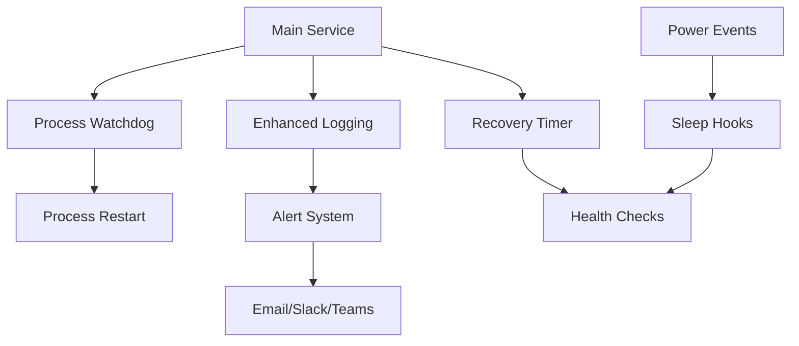

# Monitoring Agent - Fault-Tolerant System

A comprehensive fault-tolerant monitoring agent that ensures continuous operation across Linux and Windows environments, featuring automatic recovery, power event handling, and comprehensive monitoring capabilities.

## 🚀 Features

### Core Fault Tolerance
- **Automatic Process Recovery**: Monitors critical processes and restarts them automatically
- **Service Auto-Restart**: Systemd/Windows Service integration with automatic restart policies
- **Configuration Validation**: Prevents startup with invalid configurations
- **Health Monitoring**: Continuous health checks with automated recovery actions

### Power Management
- **Sleep/Hibernation Support**: Handles system suspend/resume cycles gracefully
- **Power Event Monitoring**: Detects power state changes and responds appropriately
- **Wake-up Health Checks**: Verifies system health after power events
- **Battery/Power Failure Recovery**: Maintains operation during power transitions

### Monitoring & Alerting
- **Multi-Channel Notifications**: Email, Slack, Discord, Microsoft Teams, Webhooks
- **Comprehensive Logging**: Structured logging with rotation and archival
- **Metrics Collection**: System resource monitoring and alerting
- **Real-time Dashboards**: Integration with monitoring platforms

### Cross-Platform Support
- **Linux**: Full systemd integration with watchdog support
- **Windows**: Native Windows Service with scheduled task integration
- **Container Ready**: Docker and Kubernetes deployment support

## 📋 Prerequisites

### Linux
- systemd-enabled Linux distribution
- Root access for system integration
- Required packages: `systemd`, `curl`, `bc`, `mailutils` (optional)

### Windows
- Windows 10/11 or Windows Server 2016+
- Administrator privileges
- PowerShell 5.1 or later

## 🛠️ Installation

### Quick Installation (Linux)
```bash
# Download and deploy
cd /opt/monitoring-agent
sudo ./scripts/deploy-fault-tolerance.sh install

# Verify installation
sudo ./scripts/deploy-fault-tolerance.sh validate

# Run tests
sudo ./scripts/test-fault-tolerance.sh
```

### Manual Installation

#### Linux Setup
1. **Create monitoring user**:
   ```bash
   sudo groupadd -r monitoring
   sudo useradd -r -g monitoring -d /opt/monitoring-agent monitoring
   ```

2. **Deploy systemd services**:
   ```bash
   sudo cp *.service /etc/systemd/system/
   sudo systemctl daemon-reload
   sudo systemctl enable monitoring-agent.service
   ```

3. **Install sleep monitoring**:
   ```bash
   sudo ./scripts/install-sleep-monitoring.sh install
   ```

4. **Start services**:
   ```bash
   sudo systemctl start monitoring-agent.service
   sudo systemctl start monitoring-agent-watchdog.service
   ```

#### Windows Setup
1. **Install as Windows Service**:
   ```powershell
   # Run as Administrator
   .\monitoring-agent-control.ps1 install-service
   ```

2. **Install power event monitoring**:
   ```powershell
   # Run as Administrator
   .\scripts\windows\monitoring-power-events.ps1 -Action Install
   ```

3. **Start the service**:
   ```powershell
   Start-Service MonitoringAgent
   ```

## 🔧 Configuration

### Basic Configuration
Edit `/opt/monitoring-agent/etc/ossec.conf` for agent settings:
```xml
<ossec_config>
  <client>
    <server>
      <address>your-manager-ip</address>
      <port>1514</port>
    </server>
  </client>
</ossec_config>
```

### Alert Configuration
Edit `/opt/monitoring-agent/etc/monitoring-alerts.conf`:
```bash
# Enable email alerts
ENABLE_EMAIL=true
SMTP_SERVER="smtp.gmail.com"
SMTP_PORT="587"
SMTP_USER="alerts@yourcompany.com"
SMTP_PASSWORD="your-password"
SMTP_TO="admin@yourcompany.com"

# Enable Slack notifications
ENABLE_SLACK=true
SLACK_WEBHOOK_URL="https://hooks.slack.com/services/..."
SLACK_CHANNEL="#monitoring"

# System thresholds
DISK_USAGE_WARNING=85
MEMORY_USAGE_WARNING=80
CPU_USAGE_WARNING=80
```

## 🚦 Service Management

### Linux Commands
```bash
# Service control
sudo systemctl start monitoring-agent.service
sudo systemctl stop monitoring-agent.service
sudo systemctl restart monitoring-agent.service
sudo systemctl status monitoring-agent.service

# View logs
journalctl -u monitoring-agent.service -f
tail -f /opt/monitoring-agent/logs/monitoring-agent.log

# Health check
sudo /opt/monitoring-agent/monitoring-agent-control.sh health-check

# Test fault tolerance
sudo /opt/monitoring-agent/scripts/test-fault-tolerance.sh
```

### Windows Commands
```powershell
# Service control
Start-Service MonitoringAgent
Stop-Service MonitoringAgent
Restart-Service MonitoringAgent
Get-Service MonitoringAgent

# Health check
.\monitoring-agent-control.ps1 health-check

# View logs
Get-Content .\logs\monitoring-agent.log -Tail 50 -Wait
```

## 🧪 Testing

### Automated Test Suite
```bash
# Run all tests
sudo ./scripts/test-fault-tolerance.sh

# Run specific test
sudo ./scripts/test-fault-tolerance.sh single test_process_recovery

# List available tests
./scripts/test-fault-tolerance.sh list
```

### Manual Testing
```bash
# Test process recovery
sudo pkill monitoring-agentd
# Wait 30 seconds - process should auto-restart

# Test sleep/resume
sudo systemctl suspend
# System should resume and agent should recover

# Test service restart
sudo systemctl kill monitoring-agent.service
# Service should auto-restart within 5 seconds
```

## 📊 Monitoring & Alerts

### System Metrics
The agent monitors:
- **CPU Usage**: Warning at 80%, Critical at 95%
- **Memory Usage**: Warning at 80%, Critical at 90%
- **Disk Usage**: Warning at 85%, Critical at 95%
- **Process Health**: Individual process monitoring
- **Service Uptime**: Continuous availability tracking

### Alert Channels
- **Email**: SMTP-based email notifications
- **Slack**: Real-time Slack channel notifications
- **Discord**: Discord webhook notifications
- **Microsoft Teams**: Teams channel integration
- **Webhooks**: Custom webhook integrations
- **Syslog**: System log integration

### Log Files
```
logs/
├── monitoring-agent.log      # Main agent log
├── monitoring-alerts.log     # Alert events
├── monitoring-metrics.log    # System metrics
├── monitoring-watchdog.log   # Watchdog events
└── health-report-*.log       # Periodic health reports
```

## 🔄 Fault Tolerance Features

### Process Recovery
- Monitors critical processes every 30 seconds
- Automatic restart on process failure
- Configurable restart limits and cooldown periods
- Escalation to full service restart if needed

### Service Recovery
- Systemd/Windows Service automatic restart
- Restart delays: 5s, 1m, 5m, 10m
- Start limit burst protection
- Service dependency management

### Power Event Handling
- **Linux**: systemd sleep hooks, ACPI events
- **Windows**: Power event WMI monitoring, scheduled tasks
- Automatic health checks after resume
- Process verification and restart if needed

### Configuration Protection
- Configuration validation before startup
- Automatic backup before changes
- Rollback capability on invalid configurations
- Schema validation for XML configurations

## 🐛 Troubleshooting

### Common Issues

#### Service Won't Start
```bash
# Check service status
sudo systemctl status monitoring-agent.service

# Check configuration
sudo ./monitoring-agent-control.sh test-config

# Check permissions
sudo chown -R monitoring:monitoring /opt/monitoring-agent
```

#### Processes Keep Dying
```bash
# Check system resources
df -h /opt/monitoring-agent
free -h
top

# Check for conflicting processes
ps aux | grep monitoring

# Review logs
sudo journalctl -u monitoring-agent.service --since "1 hour ago"
```

#### Alerts Not Working
```bash
# Test alert configuration
sudo ./scripts/monitoring-logging.sh test-alert

# Check network connectivity
curl -I smtp.gmail.com:587

# Verify credentials
sudo cat /opt/monitoring-agent/etc/monitoring-alerts.conf
```

### Debug Mode
```bash
# Enable debug logging
export MONITORING_LOG_LEVEL=DEBUG

# Run with verbose output
sudo ./monitoring-agent-control.sh -v start

# Monitor all logs in real-time
sudo tail -f logs/*.log
```

## 📚 Architecture

### Linux Architecture
```
monitoring-agent.service (main)
├── monitoring-agent-watchdog.service (process monitoring)
├── monitoring-agent-logging.service (enhanced logging)
├── monitoring-agent-recovery.timer (periodic health checks)
└── Sleep/Resume Hooks
    ├── /lib/systemd/system-sleep/50-monitoring-agent
    ├── monitoring-agent-resume.service
    └── monitoring-agent-wakeup.timer
```

### Windows Architecture
```
MonitoringAgent Service (main)
├── PowerShell Service Host
├── WMI Power Event Monitor
├── Scheduled Tasks
│   ├── MonitoringAgent-PowerEvents
│   └── MonitoringAgent-WMIEvents
└── Process Monitoring Loop
```

### Component Interaction


## 🔒 Security

### Permissions
- Services run as `monitoring` user (Linux) or `SYSTEM` (Windows)
- Configuration files have restricted permissions (600/640)
- Log files accessible only to monitoring user
- No elevated privileges required for operation

### Network Security
- Outbound connections only (to manager)
- Configurable firewall rules
- TLS encryption for communications
- Certificate validation

## 🤝 Contributing

1. Fork the repository
2. Create a feature branch
3. Add tests for new functionality
4. Ensure all tests pass
5. Submit a pull request

### Development Setup
```bash
# Clone repository
git clone <repository-url>
cd monitoring-agent

# Set up development environment
sudo ./scripts/deploy-fault-tolerance.sh install

# Run tests
sudo ./scripts/test-fault-tolerance.sh
```

## 📄 License

Commercial License - Copyright (C) 2025, Monitoring Solutions Inc.

## 🆘 Support

- **Documentation**: [https://docs.monitoring-solutions.com](https://docs.monitoring-solutions.com)
- **Issues**: Submit through the issue tracker
- **Email**: support@monitoring-solutions.com
- **Discord**: [https://discord.gg/monitoring-solutions](https://discord.gg/monitoring-solutions)

## 📋 Changelog

### v1.0.0 (2025-01-17)
- Initial release with fault tolerance
- Linux and Windows support
- Process monitoring and recovery
- Power event handling
- Comprehensive alerting
- Sleep/hibernation support
- Automated testing suite

---

*Built with ❤️ for reliable monitoring*